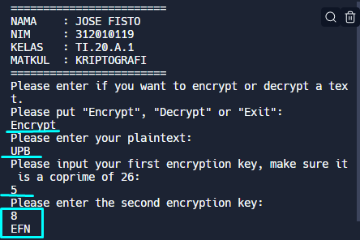
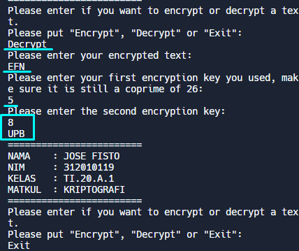

<p align="center">
	KRIPTOGRAFI
</p>
<p align="center">
	TUGAS PRAKTEK AFFINE CHIPER
</p>
<p align="center">
	Dosen Pengampu : Ahmad Turmudizy,S.Kom.,M.Kom
</p>
<p align="center"> 
	<b>Tugas untuk memenuhi syarat penilain pada Pert-7</b>
</p>

<p align="center">
	
</p>

<p align="center">
                 Nama  : Jose Fisto
</p>
<p align="center">
                 NIM   : 312010119
</p>
<p align="center">
                 Kelas : TI.20 A.1
</p>

<br/>
<br/>

<p align="center">
	<b>UNIVERSITAS PELITA BANGSA</b>
</p>
<p align="center">
	<b>FAKULTAS TEKNIK</b>
</p>
<p align="center">
	<b>TEKNIK INFORMATIKA</b>
</p>
<p align="center">
	<b>TA 2020 / 2021</b>
</p>

<br></br>

<hr>
</hr>

<br></br>

Kodingan :

### file main.py

```py
import math
#Import math module to use the math.gcd() command


def encryption():
  #Function which handles the encryption process
  encryptText = ''
  counter = 0

  plainText = input("Please enter your plaintext: \n")
  plainText = plainText.upper()
  #Takes input and changes to capital letters.

  print(
    'Please input your first encryption key, make sure it is a coprime of 26: '
  )
  inputType = 'a'
  a = int(validateType(inputType))
  #Get variable "a" from validateType function, which takes inputType as the argument.
  #Used inputType as triger in validateType if it needs to be coprime or not.
  #See rest at def validateType();

  print('Please enter the second encryption key: ')
  inputType = 'b'
  b = int(validateType(inputType))
  #Same situation, but with inputType as b.

  length = len(plainText)
  #Get length of the inputed text for use in for loop.

  for x in range(length):
    plainNum = ord(plainText[x])
    #Change the character to the Unicode number of it.
    if plainNum >= 65 and plainNum <= 90:
      #From 65 to 90 are the capital letters. Those are put into the encryption algorythm.
      encryptNum = ((plainNum - 65) * a + b) % 26
      encryptText += chr(encryptNum + 65)
      #Adds the encrypted letter to the end of the encrypted text after getting turned back to character.
      counter += 1
      #This is for testing in case of errors.
    elif plainNum == 32:
      #32 is whitespace, it gets converted back to character and added to end of string.
      encryptText += chr(plainNum)
      counter += 1
    #Ignores all other characters not specified.

  return encryptText
  #Returns the encrypted text to main function


#Similar workflow of code to encryption.
def decryption():
  plainText = ''
  counter = 0

  encryptText = input('Please enter your encrypted text: \n')
  encryptText = encryptText.upper()

  print(
    'Please enter your first encryption key you used, make sure it is still a coprime of 26: '
  )
  inputType = 'a'
  a = int(validateType(inputType))

  print('Please enter the second encryption key: ')
  inputType = 'b'
  b = int(validateType(inputType))

  length = len(encryptText)

  aInverse = int(inverse(a, 26))
  #Takes integer "a" and inputs it into inverse function with 26 as the other argument.

  for x in range(length):
    encryptNum = ord(encryptText[x])
    if encryptNum >= 65 and encryptNum <= 90:
      #Decryption algorythm.
      plainNum = (((encryptNum - 65) - b) * aInverse) % 26
      plainText += chr(plainNum + 65)
      counter += 1
    elif encryptNum == 32:
      plainText += chr(encryptNum)
      counter += 1

  return plainText


def validateType(inputType):
  a = input('')
  #Takes input

  while a.isdigit() == False:
    #.isdigit() checks if variable before it is digit or not, returns False if not, therefor triggers while loop.
    a = input('That is not a valid number. Please try again: \n')

  if inputType == 'a':
    #Checks the argument variable inputType. If it is "a", goes into validateCoprime with argument "a".
    validateCoprime(a)

  return a
  #Once function runs out, returns "a" to functions.


def validateCoprime(a):
  inputType = 'a'
  #Assign inputType again, it has gone out of scope.
  testA = math.gcd(int(a), 26)
  #Uses math function, which finds the greatest common divisor.

  while testA != 1:
    #If gcd was not 1, it goes back to number validation.
    print('That number is not a coprime of 26. Please try again: ')
    validateType(inputType)
    break
    #Once its run through, it breaks out of the loops.


def inverse(a, m):
  a1 = 1
  a2 = a

  b1 = 0
  b2 = m

  while b2 != 0:
    #Keeps looping until b2 (remainder) is 0.
    x = a2 // b2
    b1, b2, a1, a2 = (a1 - x * b1), (a2 - x * b2), b1, b2
    #All on one line, so it all gets changed at same time, to the old value, not the updated one yet.
  return a1 % m
  #A could be negative so we take the remainder of it, which will be positive to return.


def main():
  choice = ''

  while choice != 'Exit':
    #This while loop doesnt actually do anything, it would still loop forever so I simplified it.
    #while 1 != 2:
    #Infinite loop, only way to break out of is by inputting "Exit" (or CTRL + C).
    print('========================')
    print('NAMA    : JOSE FISTO')
    print('NIM     : 312010119')
    print('KELAS   : TI.20.A.1')
    print('MATKUL  : KRIPTOGRAFI')
    print('========================')
    choice = input(
      'Please enter if you want to encrypt or decrypt a text. \nPlease put "Encrypt", "Decrypt" or "Exit": \n'
    )
    if choice == 'Encrypt':
      print(encryption())
      #Prints out the returned value from encryption function.
    elif choice == 'Decrypt':
      print(decryption())
    elif choice == 'Exit':
      break
      #Once input is "Exit", break out of the loop to the end of it.
    else:
      print('You have entered incorrect choice.')
      choice = main()
      #If not one of the options is inputted, starts again from the start of the main function and asks again.
  return choice
  #This is used to not loop through extra times if the else gets triggered.


main()
#This can also be triggered manually in command line, but starts the main function, starting off the whole process.

#test = input("Here: ");
#Test if it prints out Exit at end. If it is run normally, it will not, only in shell.
```

### file BreakAffineCipher.py

```py
import math;
#Using math module again for greatest common divider.
import time;
#For testing purposes, i was monitoring efficient ways of running it.

array = (open("dictionary.txt").read()).split("\n")
#This line imports the dictionary file and reads it, splits each item by the new line
#And assigns each new line to the array as a seperate element, creating a big array with words to be used later.


def crackAffine(m):
    plainText = '';
    counter = 0;
    matchList = [];

    encryptText = input('Please enter your encrypted text: \n');
    encryptText = encryptText.upper();

    start_time = time.time();
    #Sets start time here (time.time() is the current time).
    
    length = len(encryptText);
    #Simular to decryption however only asks for the encrypted text, not the keys.
    
    print('Thank you, working on it...');
    
    coprimes = [];
    for i in range(m):
        #A function which takes m, the range of letters, and checks for coprimes in that range.
        testI = math.gcd(int(i), int(m));
        if testI == 1:
            coprimes.append(i);
            #If it is a coprime, appends it to the end of the array.

    for i in range(len(coprimes)):
        #Nested for loops. This one takes the "a" variable, which needs to be the coprime, from the coprime array.
        a = int(inverse(coprimes[i], m));
        for b in range(m):
            #This loop takes the "b" variable, from 0 to "m".
            plainText = '';
            for y in range(length):
                #This one takes the letters from the encrypted text one by one as "y".
                encryptNum = ord(encryptText[y]);
                #Changing it to Unicode number.
                if encryptNum >= 65 and encryptNum <= 90:
                    #If character was a capital letter, runs through this if loop.
                    plainNum = (((encryptNum - 65) - b) * a) % m;
                    #This is the decryption algorithm, using "a", "b", "m" and the Unicode number of character.
                    plainText += chr(plainNum + 65);
                    #Appends the final character version of Unicode number to end of string.
                    counter += 1;
                    #For testing.
                elif encryptNum == 32:
                    #If space, adds it to the string too
                    plainText += chr(encryptNum);
                    counter += 1;
                #Every other character gets discarded.
            
            match = dictionaryCheck(plainText);
            #Assign the returned class object 
            if match.weight != 0:
                #Check the weight value of class and goes into if statement if not 0.
                matchList.append(match);
                #Appends the instance of the class to matchList, which keeps all the possible ones which triggered
                
            
    sortedList = sorted(matchList, key=lambda i: i.weight, reverse=True);
    #Make a new list from matchList, which gets organised in descending order
    #Lambda is a anonymous function, it takes the weight value and organises by them.

    print("My program took", time.time() - start_time, "to run")
    #This is the end of timeing. If we go on for longer, the inputs make the time very extended
    #And not even neceserry after, as not many calculations, functions happening after this.

    for z in sortedList:
        print(z.text, "with a weight of", z.weight);
        #For loop goes through the sorted list from the one with highest weight, and prints them one by one.
        trigger = input("Enter \"Exit\" if you found it, or press enter to continue or enter \"All\" for all results:\n")
        if trigger == "Exit":
            break;
        elif trigger == "All":
            for x in sortedList:
                print(x.text, "with a weight of", x.weight);
                #Gives the option to see all the words which matched instead of going through them one by one.
            break

    
def inverse(a, m):
    a1 = 1;
    a2 = a;

    b1 = 0;
    b2 = m;

    while b2 != 0:
        #Loops around untill b2 is equal to 0 (so the remainder is 0).
        x = a2 // b2;
        b1, b2, a1, a2 = (a1 - x * b1), (a2 - x * b2), b1, b2;
        #All in one line so they all get changed at same time, and not messsed up by the new values.
    return a1 % m;
    #Returns the remainder. This is to make sure it is not a negative number or a large number. 

def dictionaryCheck(plain):
    #This function is used to compare the strings which go through brute force to the dictionary array.
    lenCounter = 0;
    for i in array:
        #Takes each word from the array one by one
        if i in plain:
            #If the word is in the string
            lenCounter += len(i)*len(i);
            #Adds the number of letters squared to the counter
    
    class textCounter:
        #Made a class to contain the counter and text to be able to return to other function
        def __init__(self):
            #Init is a reserved method in classes, a constructor. Specify all the values in it by self.value 
            self.text = plain
            self.weight = lenCounter

    return textCounter();
    #Return it to function.

def main():
    m = 26;
    #Range of letters.
    crackAffine(m);
    #Starts the function with argument "m".
    #Encrypted text is "YFKLZOYWFFSRYGSC"            
    
    trigger = input("Press enter to exit or type \"Again\" to restart.");
    if trigger == "Again":
        main();


main();
#Boots up the start of the program.
```

## Hasil / setelah di running

Output "Encrypt" :

<p align="center">
	
</p>

Output "Decrypt" :

<p align="center">
	
</p>

Sekian, terima kasih
